# ScalarLM API Documentation

## API Architecture Overview

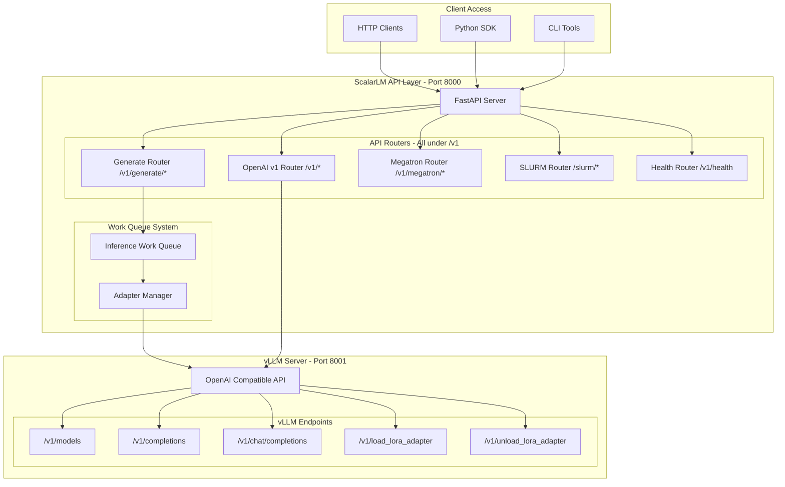

## ScalarLM API Endpoints (Port 8000)

### 1. Generation Endpoints (Work Queue Based)

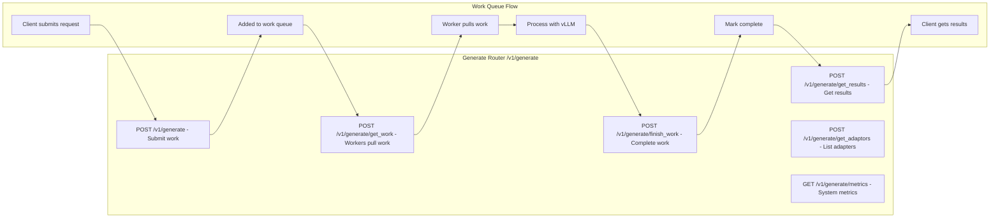

#### POST `/v1/generate`
```json
// Request - Submit work to queue
{
  "prompt": "What is 3+3?",
  "model": "TinyLlama/TinyLlama-1.1B-Chat-v1.0",  // or job hash like "a1b2c3d4e5f6"
  "max_tokens": 100,
  "request_type": "generate"
}

// Response
{
  "request_id": "req_12345",
  "status": "queued"
}
```

#### POST `/v1/generate/get_work`
```json
// Request - Worker pulls work
{
  "batch_size": 4,
  "loaded_adaptor_count": 2
}

// Response
{
  "requests": [
    {
      "prompt": "What is 3+3?",
      "request_id": "req_12345",
      "model": "TinyLlama/TinyLlama-1.1B-Chat-v1.0",
      "request_type": "generate",
      "max_tokens": 100
    }
  ],
  "new_adaptors": {
    "new_adaptors": ["job_hash_123", "job_hash_456"]
  }
}
```

#### POST `/v1/generate/finish_work`
```json
// Request - Worker completes work
{
  "requests": [
    {
      "request_id": "req_12345",
      "response": "The answer is 6.",
      "token_count": 15,
      "flop_count": 150000000
    }
  ]
}
```

#### POST `/v1/generate/get_results`
```json
// Request - Client retrieves results
{
  "request_ids": ["req_12345"]
}

// Response
{
  "results": [
    {
      "request_id": "req_12345",
      "response": "The answer is 6.",
      "token_count": 15,
      "flop_count": 150000000,
      "status": "completed"
    }
  ]
}
```

### 2. Training Endpoints (Megatron Router)

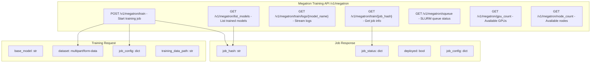

#### POST `/v1/megatron/train`
```bash
# Training request with multipart form data
curl -X POST http://localhost:8000/v1/megatron/train \
  -F "file=@training_data.jsonl" \
  -F 'config={
    "model": "TinyLlama/TinyLlama-1.1B-Chat-v1.0",
    "num_steps": 15,
    "learning_rate": 0.0001,
    "batch_size": 4,
    "lora_r": 8,
    "lora_alpha": 16
  }'

# Response
{
  "job_status": {
    "job_id": "12345",
    "status": "PENDING",
    "slurm_state": "PD"
  },
  "job_config": {
    "model": "TinyLlama/TinyLlama-1.1B-Chat-v1.0",
    "num_steps": 15,
    "job_hash": "a1b2c3d4e5f6"
  },
  "deployed": false
}
```

#### GET `/v1/megatron/train/{job_hash}`
```json
// Response
{
  "job_hash": "a1b2c3d4e5f6",
  "status": "RUNNING",
  "checkpoint_path": "/app/cray/jobs/a1b2c3d4e5f6/checkpoint_15.pt",
  "current_step": 10,
  "total_steps": 15,
  "loss": 0.234
}
```

### 3. SLURM Management Endpoints

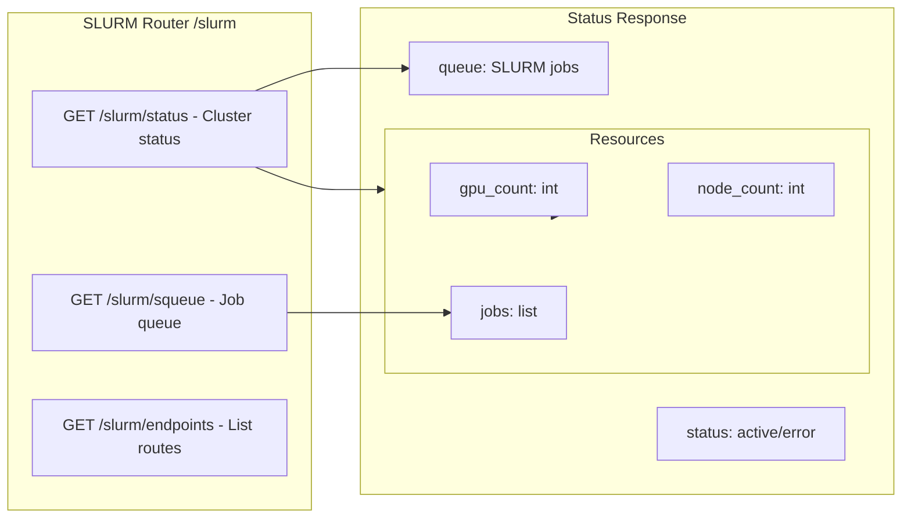

#### GET `/slurm/status`
```json
// Response
{
  "queue": {
    "jobs": [
      {
        "job_id": "12345",
        "name": "train_a1b2c3d4",
        "state": "RUNNING",
        "time": "0:05:23",
        "nodes": 1
      }
    ]
  },
  "resources": {
    "gpu_count": 8,
    "node_count": 2
  },
  "status": "active"
}
```

### 4. Health & Metrics Endpoints

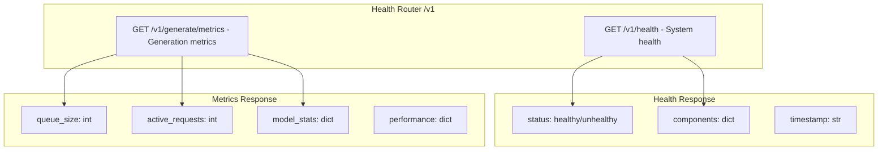

#### GET `/v1/health`
```json
// Response
{
  "status": "healthy",
  "components": {
    "vllm_server": "healthy",
    "work_queue": "healthy",
    "slurm": "active"
  },
  "timestamp": "2024-01-27T10:00:00Z"
}
```

## OpenAI Compatible API (Port 8000 → 8001)

### OpenAI v1 Endpoints (ScalarLM Proxy)

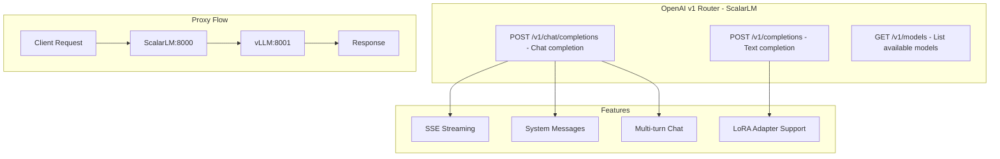

#### POST `/v1/chat/completions`
```json
// Request (proxied to vLLM)
{
  "model": "TinyLlama/TinyLlama-1.1B-Chat-v1.0",  // or job hash
  "messages": [
    {"role": "system", "content": "You are a helpful assistant."},
    {"role": "user", "content": "What is 3+3?"}
  ],
  "temperature": 0.7,
  "max_tokens": 100,
  "stream": false
}

// Response (from vLLM)
{
  "id": "chatcmpl-123",
  "object": "chat.completion",
  "created": 1706352000,
  "model": "TinyLlama/TinyLlama-1.1B-Chat-v1.0",
  "choices": [{
    "index": 0,
    "message": {
      "role": "assistant",
      "content": "3 + 3 equals 6."
    },
    "finish_reason": "stop"
  }],
  "usage": {
    "prompt_tokens": 20,
    "completion_tokens": 10,
    "total_tokens": 30
  }
}
```

#### POST `/v1/completions`
```json
// Request (proxied to vLLM)
{
  "model": "TinyLlama/TinyLlama-1.1B-Chat-v1.0",
  "prompt": "The capital of France is",
  "max_tokens": 10,
  "temperature": 0.0,
  "stream": true
}

// Response (SSE stream from vLLM)
data: {"id":"cmpl-1","object":"text_completion","created":1706352000,"model":"TinyLlama/TinyLlama-1.1B-Chat-v1.0","choices":[{"text":" Paris","index":0,"logprobs":null,"finish_reason":null}]}
data: {"id":"cmpl-1","object":"text_completion","created":1706352000,"model":"TinyLlama/TinyLlama-1.1B-Chat-v1.0","choices":[{"text":".","index":0,"logprobs":null,"finish_reason":"stop"}]}
data: [DONE]
```

## vLLM Server Native Endpoints (Port 8001)

### vLLM OpenAI API

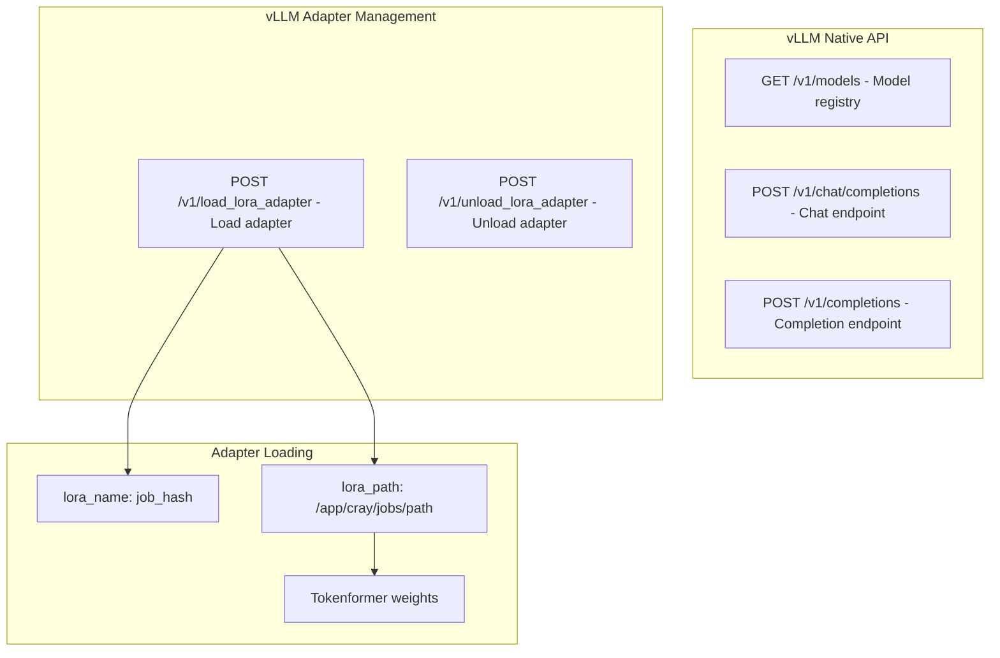

#### POST `/v1/load_lora_adapter` (vLLM Server)
```json
// Request (from generate worker)
{
  "lora_name": "a1b2c3d4e5f6",
  "lora_path": "/app/cray/jobs/a1b2c3d4e5f6"
}

// Note: The adapter loading uses ScalarLM's Tokenformer system
// to load .pt checkpoint files and apply weights to base model
```

## API Authentication & Headers

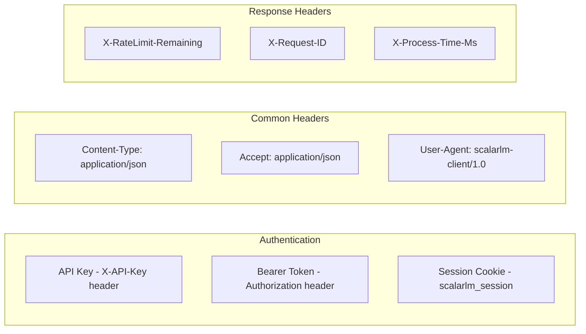

## Request Flow Diagram

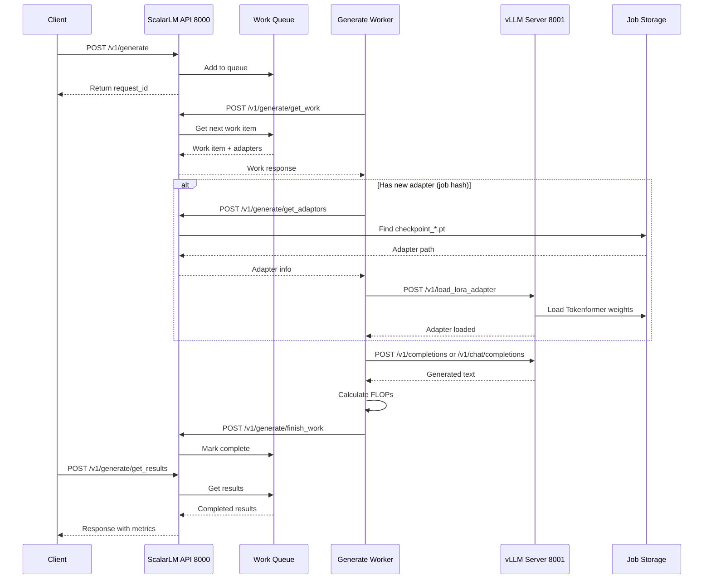

## Error Responses

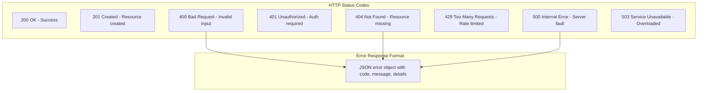

## WebSocket Endpoints (Future)

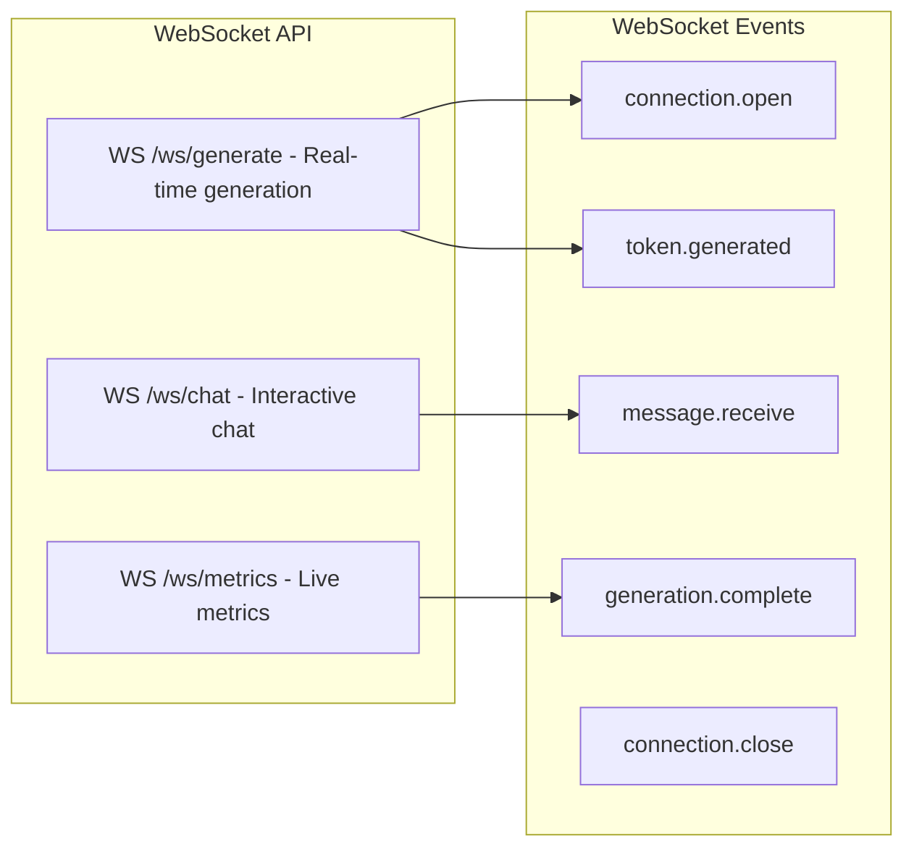

## SDK Usage Examples

### Python SDK (Work Queue Based)
```python
from scalarlm import Client
import asyncio

# Initialize client
client = Client(base_url="http://localhost:8000")

# Submit generation request (async)
async def generate_text():
    # Submit work to queue
    request_id = await client.generate(
        prompt="What is 3+3?",
        model="TinyLlama/TinyLlama-1.1B-Chat-v1.0",
        max_tokens=100
    )
    
    # Poll for results
    result = await client.get_results(request_id)
    print(result.response)
    print(f"FLOPs used: {result.flop_count}")

# Train model using Megatron
async def train_model():
    with open("training_data.jsonl", "rb") as f:
        job = await client.megatron.train(
            file=f,
            config={
                "model": "TinyLlama/TinyLlama-1.1B-Chat-v1.0",
                "num_steps": 15,
                "learning_rate": 0.0001
            }
        )
    print(f"Training job hash: {job.job_hash}")
    
    # Use trained model (by job hash)
    request_id = await client.generate(
        prompt="What is 5+5?",
        model=job.job_hash,  # Use job hash as model
        max_tokens=100
    )
```

### cURL Examples
```bash
# Health check
curl http://localhost:8000/v1/health

# List models via OpenAI API
curl http://localhost:8000/v1/models

# Submit generation work
curl -X POST http://localhost:8000/v1/generate \
  -H "Content-Type: application/json" \
  -d '{
    "prompt": "What is 3+3?",
    "model": "TinyLlama/TinyLlama-1.1B-Chat-v1.0",
    "max_tokens": 100,
    "request_type": "generate"
  }'
# Returns: {"request_id": "req_12345", "status": "queued"}

# Get results
curl -X POST http://localhost:8000/v1/generate/get_results \
  -H "Content-Type: application/json" \
  -d '{
    "request_ids": ["req_12345"]
  }'

# OpenAI-compatible chat completion (direct proxy)
curl -X POST http://localhost:8000/v1/chat/completions \
  -H "Content-Type: application/json" \
  -d '{
    "model": "TinyLlama/TinyLlama-1.1B-Chat-v1.0",
    "messages": [
      {"role": "user", "content": "What is 3+3?"}
    ],
    "stream": false
  }'

# Check SLURM status
curl http://localhost:8000/slurm/status
```

## Rate Limiting & Quotas

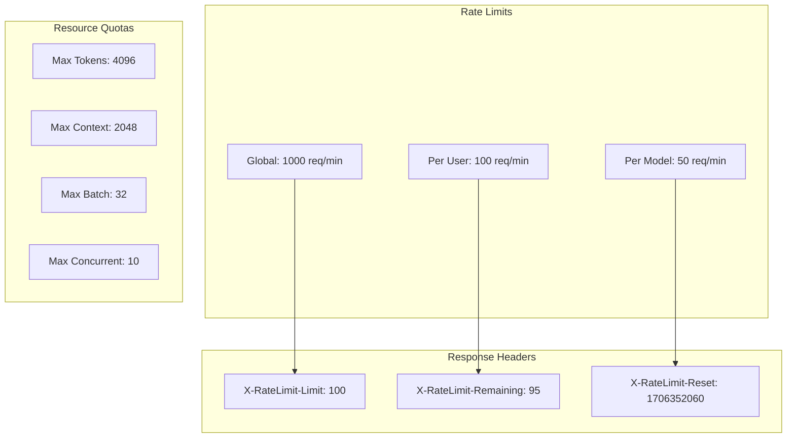