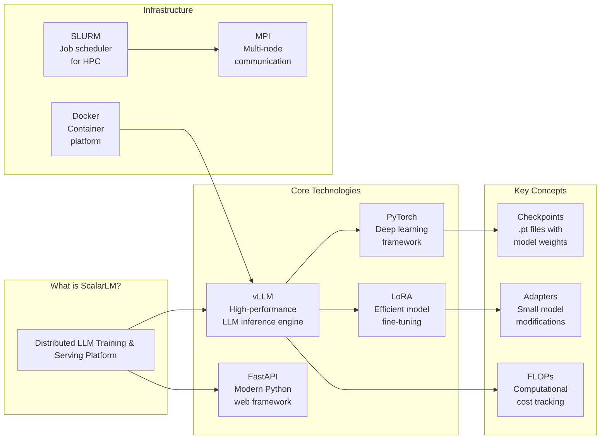
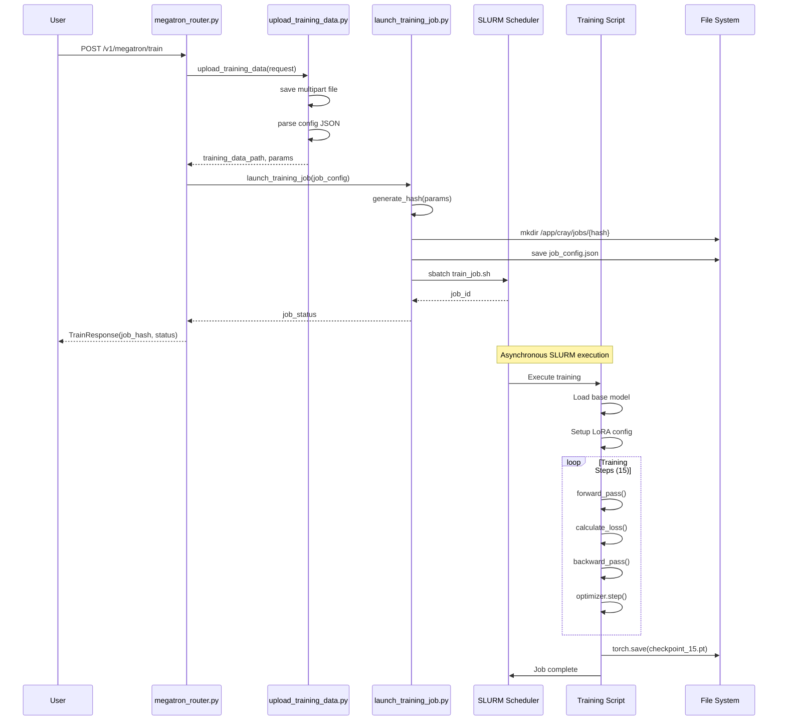
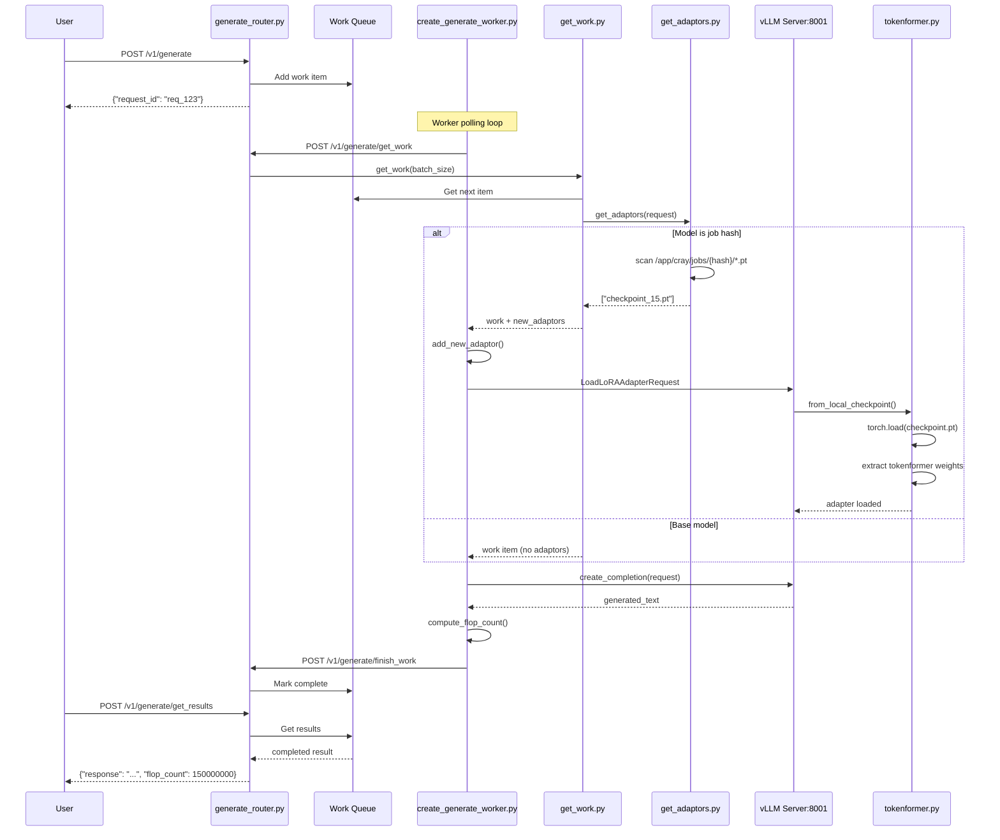
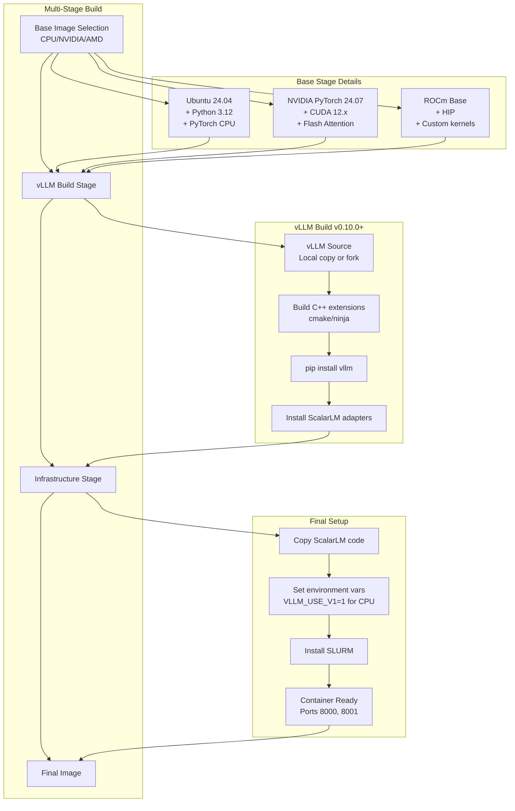
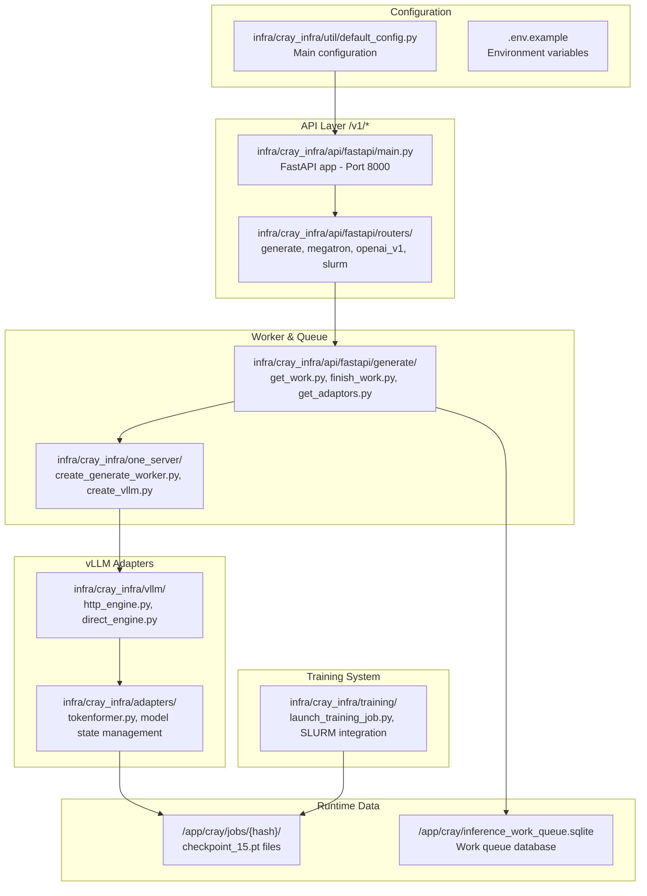

# ScalarLM Architecture Documentation

## 1. High-Level System Architecture

```mermaid
graph TB
    subgraph "User Layer"
        CLI[CLI/Scripts]
        API[REST API]
        SDK[Python SDK]
        OpenAI[OpenAI Compatible]
    end

    subgraph "ScalarLM Core - Port 8000"
        Router[FastAPI Router<br/>All /v1/* endpoints]
        WorkQueue[Inference Work Queue<br/>SQLite-based]
        GenWorker[Generate Worker<br/>Async processing]
        TrainWorker[Training Worker<br/>SLURM jobs]
    end

    subgraph "vLLM Engine Layer"
        VLLMServer[vLLM Server<br/>Port 8001]
        EngineFactory[Engine Factory<br/>HTTP or Direct mode]
        TokenMgr[Tokenformer Manager<br/>Checkpoint loader]
    end

    subgraph "Model Storage"
        BaseModel[Base Models<br/>HuggingFace models]
        TrainedModels[Trained Checkpoints<br/>/app/cray/jobs/{hash}/*.pt]
        Adapters[Tokenformer Adapters<br/>Weight modifications]
    end

    subgraph "Infrastructure"
        Docker[Docker Containers]
        SLURM[SLURM Scheduler]
        K8s[Kubernetes<br/>Optional]
    end

    CLI --> Router
    API --> Router
    SDK --> Router
    OpenAI --> Router

    Router --> WorkQueue
    WorkQueue --> GenWorker
    Router --> TrainWorker

    GenWorker --> EngineFactory
    EngineFactory --> VLLMServer
    
    GenWorker --> TokenMgr
    TokenMgr --> TrainedModels
    TokenMgr --> Adapters
    
    VLLMServer --> BaseModel
    VLLMServer --> Adapters

    TrainWorker --> SLURM
    SLURM --> TrainedModels
    
    Docker --> VLLMServer
    Docker --> Router
```

## 2. Technology Overview



## 3. Training Pipeline (Mid-Level)

```mermaid
flowchart TD
    Start[User submits<br/>training request] --> API["/v1/megatron/train endpoint"]
    
    API --> Upload[Upload training data<br/>multipart/form-data]
    Upload --> Validate{Validate<br/>parameters}
    Validate -->|Invalid| Error[Return 422 error]
    Validate -->|Valid| Hash[Generate job hash<br/>from parameters]
    
    Hash --> JobDir[Create job directory<br/>/app/cray/jobs/{hash}]
    JobDir --> SLURM[Submit SLURM job]
    
    SLURM --> Response[Return job_status<br/>and job_hash]
    
    subgraph "SLURM Execution"
        Worker[Training Worker] --> LoadBase[Load base model<br/>e.g. TinyLlama]
        LoadBase --> PrepData[Prepare training<br/>dataset from JSONL]
        
        PrepData --> Train[Train with LoRA<br/>15-150 steps]
        
        Train --> Save[Save checkpoint<br/>checkpoint_15.pt]
        Save --> Metrics[Log metrics<br/>loss, FLOPs, time]
    end
    
    Metrics --> Complete[Job completes]
    Complete --> Ready[Model ready as<br/>adapter via hash]
```

## 4. Generation Pipeline (Mid-Level)

```mermaid
flowchart LR
    subgraph "Work Queue Flow"
        User[User Request] --> Router["/v1/generate"]
        Router --> Queue[SQLite Work Queue]
        Queue --> GetWork[Worker pulls work<br/>via get_work]
    end

    subgraph "Adapter Discovery"
        GetWork --> CheckModel{Is model<br/>a job hash?}
        CheckModel -->|Yes| GetAdaptors[get_adaptors()<br/>finds .pt files]
        CheckModel -->|No| UseBase[Use base model]
        GetAdaptors --> LoadLoRA[LoadLoRAAdapterRequest<br/>to vLLM]
        LoadLoRA --> Tokenformer[Load via<br/>Tokenformer system]
    end

    subgraph "Generation"
        Tokenformer --> Generate[vLLM generates<br/>via HTTP/Direct]
        UseBase --> Generate
        Generate --> FLOPs[Calculate FLOPs]
        FLOPs --> FinishWork[finish_work()<br/>marks complete]
    end

    subgraph "Response"
        FinishWork --> Queue2[Update queue]
        Queue2 --> GetResults[Client calls<br/>get_results()]
        GetResults --> Response[Return response<br/>with metrics]
    end
```

## 5. Low-Level Training Code Path



## 6. Low-Level Generation Code Path



## 7. Component Relationships

```mermaid
graph TD
    subgraph "API Layer - All /v1/*"
        FastAPI[FastAPI Application<br/>main.py]
        GenRouter[Generate Router<br/>generate_router.py]
        OpenAIv1[OpenAI v1 Router<br/>openai_v1_router.py]
        MegatronRouter[Megatron Router<br/>megatron_router.py]
        SLURMRouter[SLURM Router<br/>slurm_router.py]
        HealthRouter[Health Router<br/>health_router.py]
    end

    subgraph "Work Queue System"
        GenWorker[Generate Worker<br/>create_generate_worker.py]
        GetWork[Get Work<br/>get_work.py]
        GetAdaptors[Get Adaptors<br/>get_adaptors.py]
        FinishWork[Finish Work<br/>finish_work.py]
        WorkQueue[SQLite Queue<br/>inference_work_queue.py]
    end

    subgraph "Adapter Management"
        TokenMgr[Tokenformer Manager<br/>tokenformer.py]
        ModelState[Model State Manager<br/>Manages weight swapping]
        AdapterCache[Adapter Cache<br/>LRU caching]
    end

    subgraph "vLLM Integration"
        EngineFactory[Engine Factory<br/>engine_factory.py]
        HTTPEngine[HTTP Engine<br/>http_engine.py - Port 8001]
        DirectEngine[Direct Engine<br/>direct_engine.py]
        CreateVLLM[Create vLLM<br/>create_vllm.py]
    end

    subgraph "Storage"
        Jobs[Job Checkpoints<br/>/app/cray/jobs/{hash}/*.pt]
        Config[Configuration<br/>default_config.py]
    end

    FastAPI --> GenRouter
    FastAPI --> OpenAIv1
    FastAPI --> MegatronRouter
    FastAPI --> SLURMRouter
    FastAPI --> HealthRouter

    GenRouter --> GetWork
    GenRouter --> FinishWork
    GetWork --> WorkQueue
    GetWork --> GetAdaptors
    
    GenWorker --> GetWork
    GenWorker --> GetAdaptors
    GenWorker --> EngineFactory
    
    GetAdaptors --> Jobs
    GenWorker --> TokenMgr
    
    TokenMgr --> ModelState
    TokenMgr --> AdapterCache
    TokenMgr --> Jobs
    
    EngineFactory --> HTTPEngine
    EngineFactory --> DirectEngine
    CreateVLLM --> HTTPEngine
    
    Config --> EngineFactory
    Config --> GenWorker
```

## 8. Docker Build Process



## 9. Key File Locations



## Notes for Emacs Users

To work with these Mermaid diagrams in Emacs:

1. Install `mermaid-mode` from MELPA:
   ```elisp
   M-x package-install RET mermaid-mode RET
   ```

2. For live preview, install `mermaid-cli`:
   ```bash
   npm install -g @mermaid-js/mermaid-cli
   ```

3. Configure Emacs:
   ```elisp
   (setq mermaid-output-format ".svg")
   (setq mermaid-tmp-dir "/tmp/mermaid")
   ```

4. Commands:
   - `C-c C-c` - Compile current diagram
   - `C-c C-o` - Open compiled diagram
   - `C-c C-f` - Compile file
   - `C-c C-r` - Compile region

5. For inline preview in Org-mode:
   ```org
   #+BEGIN_SRC mermaid :file diagram.svg
   graph TD
       A --> B
   #+END_SRC
   ```
